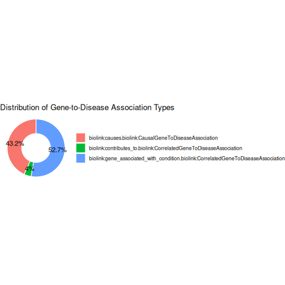
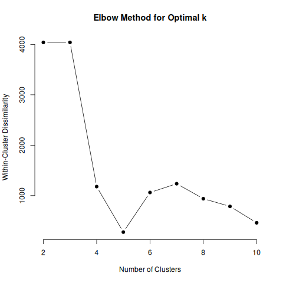
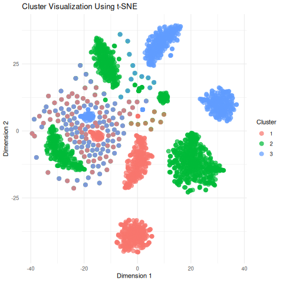
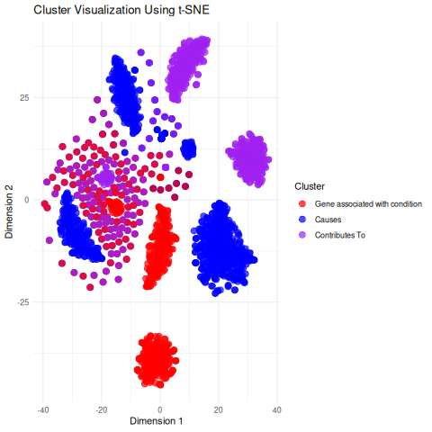
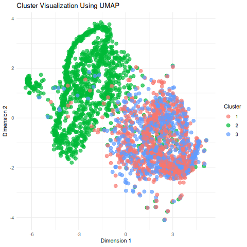
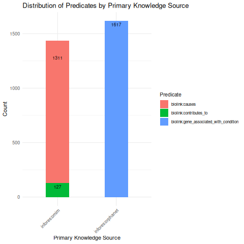

Project Overview

This is a part of my PhD biostatistics course BIOS 611: Introduction to Data Science. This project aims to analyze a biomedical knowledge graph comprising nodes and edges, representing relationships between entities such as genes and diseases. Each node and edge have specific attributes that provide detailed information about the entities and their interactions. The primary focus is on analyzing the data, testing the relationships between genes and diseases, and exploring patterns of gene-disease associations using clustering techniques. The hypothesis is that certain genes may cluster around specific diseases based on shared attributes such as cross-references (Xref) and taxonomic labels. The goal here is to identify clusters of genes associated with diseases, potentially revealing shared biological functions or pathways. The approach followed here is to use clustering algorithms (e.g.: K-means, hierarchical clustering) to visualize the results with heat maps, dendrograms, and scatter plots.

About the Dataset

The dataset is from the Monarch Initiative, an international consortium recognized for its leadership in advancing key global standards and semantic data integration technologies. Its resources and integrated data serve as a foundational framework for numerous downstream applications and diverse contexts. The aim of the consortium is to accelerate precision medicine through open source. More about that here: https://monarchinitiative.org/.

Key insights about the knowledge graph dataset

The nodes represent biological entities like genes, diseases, and more; such as Id, Category, Name, Xref, Description, and more.
The edges represent the relationships or interactions between these entities, detailing various attributes such as the type of relationship, evidence supporting it, and related publications; such as Id, Predicate, Provided By, Publications, and others.
The structure allows for the integration of complex biological and medical information from various sources, facilitating deeper analysis and insights.
This dataset can be used to study how different biological entities, particularly genes, interact with each other and other types of nodes, like diseases.
The availability of multiple knowledge sources and publication references adds credibility and depth to the dataset, making it a valuable resource for research and analysis in biomedical fields.

{align="center"}
This chart illustrates the distribution of three different types of gene-to-disease associations based on the Biolink Model's classification. The proportions are as follows:
1. Gene Associated with Condition (52.7% - represented in blue): This is the most prevalent type, indicating genes that are broadly associated with the given condition without necessarily implying causation.
2. Causal Gene-to-Disease Association (43.2% - represented in red): This represents cases where a gene has been identified as directly causing the condition.
3. Correlated Gene-to-Disease Association (4.1% - represented in green): This is the least frequent type, indicating genes that contribute to or correlate with the condition but are not the primary cause.
These proportions provide insights into the nature of genetic studies related to the disease, emphasizing that while a majority of gene associations are observed, only a smaller portion (43.2%) are confirmed as causal relationships.

{align="center"}
The elbow plot visualizes the relationship between the number of clusters (k) and the within-cluster dissimilarity (also known as the sum of squared distances or inertia). The x-axis represents the number of clusters (k), while the y-axis shows the within-cluster dissimilarity. The goal is to identify the optimal number of clusters that minimize within-cluster dissimilarity while avoiding overfitting by using too many clusters.
The optimal value of k is determined by observing the "elbow" point on the plot—where the rate of reduction in dissimilarity sharply decreases. This point represents a balance between compactness (minimizing within-cluster dissimilarity) and simplicity (avoiding unnecessary complexity).
* In the plot, the within-cluster dissimilarity drops significantly from k = 2 to k = 3, indicating that increasing the number of clusters from 2 to 3 captures a substantial improvement in grouping the data.
* After k = 3, the reduction in dissimilarity becomes less significant, as the curve starts to flatten, indicating diminishing returns for additional clusters.
Thus, k = 3 is chosen because it provides a meaningful segmentation of the data while avoiding unnecessary complexity. This aligns with the elbow method's principle of identifying the optimal trade-off.

Tsne:

One hot encoding is used for the categorical data for clustering. 

{align="center"}
This t-SNE (t-distributed Stochastic Neighbor Embedding) plot visualizes the clustering of data points based on gene-to-disease associations. The plot maps high-dimensional data into a two-dimensional space (Dimension 1 and Dimension 2) while preserving the relative distances between data points to highlight natural groupings.
Key Features:
1. Clusters:
    * Red: Represents genes broadly associated with a condition.
    * Blue: Represents causal gene-to-disease associations.
    * Purple: Represents genes contributing to or correlating with a condition.
2. Spatial Distribution:
    * The proximity of points within each cluster indicates the similarity of the data points in the high-dimensional space.
    * Overlapping clusters suggest shared features or associations between different gene categories.
3. Cluster Separation:
    * While there is some overlap between clusters, distinct regions dominated by each color (red, blue, purple) are visible. This reflects distinct patterns in how genes relate to diseases.
Insights:
* The clustering reflects the relationship between genes and diseases in terms of association type.
* The overlap between clusters (e.g., red and purple) could indicate cases where genes show both association and correlation/contribution to the disease.
* This visualization helps identify patterns and groupings that might not be apparent in higher-dimensional data, aiding in the interpretation of gene-disease relationships.

{align="center"}
The features were identified by comparing with the original data.

Umap Analysis:

Dimentionality reduction was performed using umap. 

{align="center"}
This Umap plot shows two distinct patterns: one is a mix of clusters 1 and 2, and the other is cluster 3. Upon further exploration, it is identified that Umap captures the clusters based on the primary knowledge source.

{align="center"}
The summary plot illustrates the distribution of predicates (relationships between genes and diseases) by their primary knowledge source, focusing on two sources: Inforres-Omim and Inforres-Orphanet. Each bar represents the count of associations for three predicate categories: "causes," "contributes to," and "gene associated with condition."
Key Features:
1. Primary Knowledge Sources:
    * Inforres-Omim: Shown on the left, it is a source with a higher count of "causes" (red bar) compared to the other predicates.
    * Inforres-Orphanet: Shown on the right, it has the highest count of "gene associated with condition" (blue bar).
2. Predicate Categories:
    * biolink:causes (red): Predominantly derived from Inforres-Omim, indicating that this source primarily documents causal relationships.
    * biolink:contributes_to (green): A small count compared to the other predicates, indicating this type of relationship is less frequently documented across both sources.
    * biolink:gene_associated_with_condition (blue): Dominates Inforres-Orphanet, suggesting this source is more focused on broader gene-disease associations.
Insights:
* Inforres-Omim tends to emphasize causal gene-disease associations, as indicated by the predominance of the red bar.
* Inforres-Orphanet focuses on gene associations rather than causality, evident from the significantly higher blue bar.
* The relatively small green bars highlight that the "contributes to" relationship is less commonly documented across both sources.
This plot provides insights into the focus and strengths of the different knowledge sources in documenting gene-disease relationships, which can guide the selection of sources based on specific research needs.

Interestingly, tsne captures the predicates as clusters and umap captures the clusters based on the primary knowledge source. 

